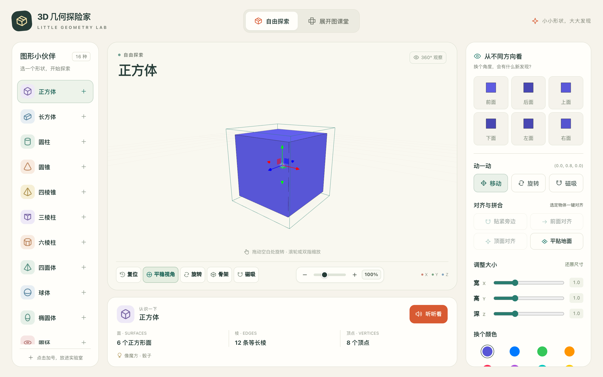
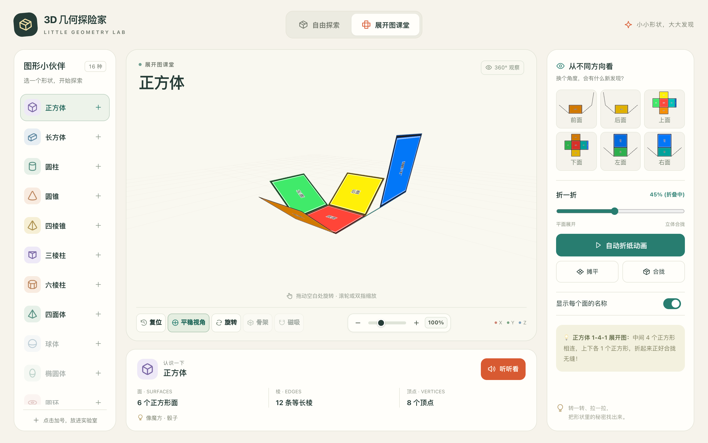
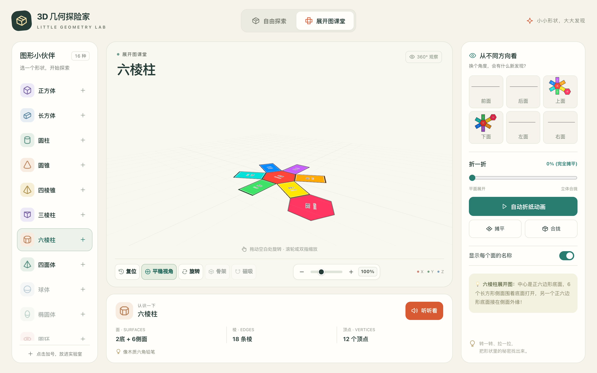
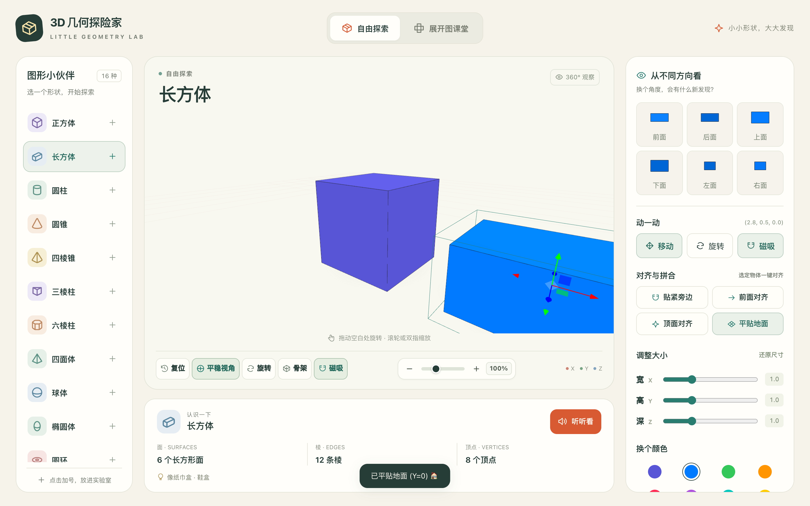

# 3D 几何探险家 (3D Shapes for Kids)

> 🌐 **在线体验网址**：[https://3dshapes.dtbit.cloud](https://3dshapes.dtbit.cloud)

面向儿童与青少年的互动式 3D 几何图形探索实验室。通过生动直观的三维可视化、几何形体展开与折叠动画、语音讲解及动手探索，帮助孩子们轻松理解几何体的结构与特征。

---

## 📸 界面预览与使用截图

### 1. 3D 自由探索与多角度观察
支持 360° 旋转、平移缩放、顶视图/侧视图快速切换、尺寸调整与骨架透视模式：



### 2. 展开图课堂（动态折纸与折叠动画）
支持滑块自由控制展开/折叠进度，直观理解立体图形与平面展开图的对应关系：



### 3. 多边形展开图与面特征识别
每个面带有颜色区分与标识，一目了然观察棱、面、顶点的空间联系：



### 4. 磁吸拼合与积木化组合
支持多物体平贴地面、贴紧旁边与对齐吸附，如同积木般自由拼接搭建：



---

## ✨ 功能亮点

- 🎨 **3D 几何体交互探索**：直观展示正方体、长方体、圆柱、圆锥、棱锥、球体等 16 种常见几何形体。
- 📦 **展开图动画与折叠互动**：动态展示立体图形与其平面展开图之间的转换过程，支持自动折纸动画与单步微调。
- 🔊 **语音发音与解说**：支持真人语音朗读各个图形的名称、特征与生活联想（如魔方、纸箱等）。
- 🧲 **智能磁吸与对齐**：支持物体间自动吸附与一键地面平贴，轻松拼合多个几何体。
- 🖥️ **响应式与多端适配**：适配桌面端、平板及移动设备触控交互。

## 📁 目录结构

- `index.html`：项目核心网页与交互逻辑
- `vioce/`：几何图形名称与解说音频资源
- `docs/screenshots/`：项目界面预览与使用截图
- `tests/`：自动化视觉与交互回归测试套件
- `.gitignore`：Git 忽略配置

## 🚀 本地运行

无需复杂构建环境，直接在浏览器中双击打开 `index.html`，或通过本地静态服务器运行：

```bash
# 使用 Python 快速启动本地服务
python3 -m http.server 8000
```

打开浏览器访问 `http://localhost:8000` 即可体验。

## 🧪 自动化测试

项目基于 Playwright 提供了覆盖 3D 空间交互、手势旋转方向、展开图折叠精度、磁吸对齐及音频播放的端到端测试用例：

```bash
# 1. 安装测试依赖
npm install

# 2. 运行核心功能测试
npm test

# 3. 运行全部测试套件
npm run test:all
```

